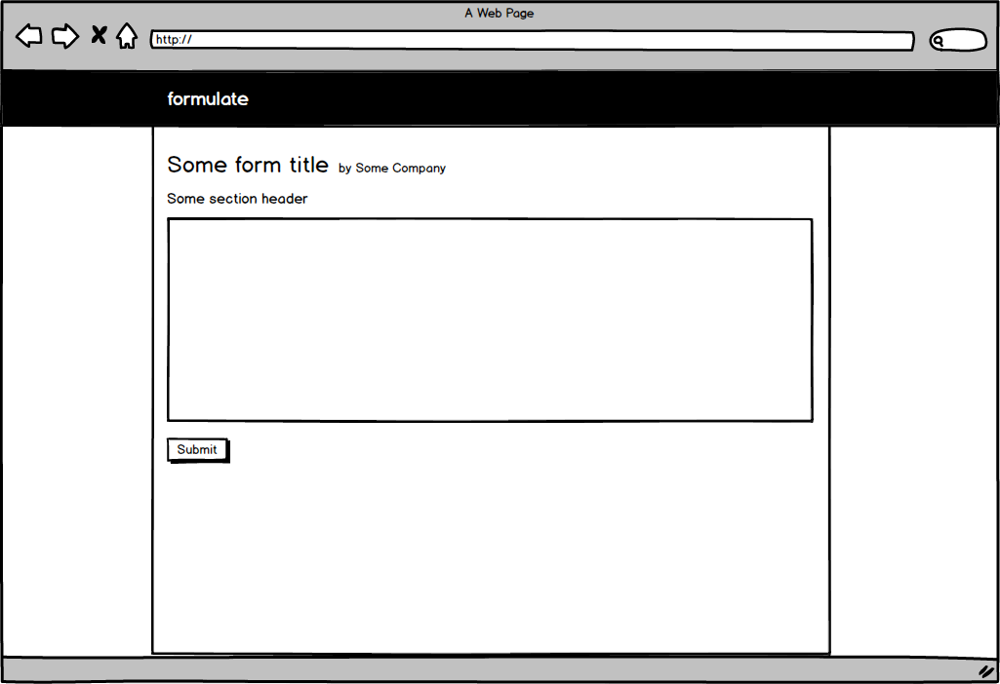

 

# Formulate
## Form builder, response manager

Formulate is a streamlined form-builder and response-manager, designed to make the process of sharing surveys or soliciting applications a breeze for everyone involved. Organizations can easily build custom forms and view, manage, and analyze responses, while, on the other end, users just fill out and click submit. Gone are the days of the emailed PDF that the user forgot to save before they sent back.

